# 8. Despliegue del proyecto

## 8.1. Entorno de despliegue

### Arquitectura de producción

```
┌─────────────────────────────────────────────────────────────────────────┐
│                       ARQUITECTURA DE DESPLIEGUE                        │
├─────────────────────────────────────────────────────────────────────────┤
│                                                                         │
│   🌐 Usuario                                                            │
│       │                                                                 │
│       ▼                                                                 │
│   ┌──────────────────────────────────────────────────────┐              │
│   │          Frontend (Render.com)                        │              │
│   │          https://frontend-crcoach.onrender.com        │              │
│   │                                                       │              │
│   │   ┌──────────────────────────────────────────────┐   │              │
│   │   │  Nginx (reverse proxy + static files)        │   │              │
│   │   │  ├─ Sirve SPA Angular (dist/)                │   │              │
│   │   │  └─ Proxy pass /api/ → https://backend-...   │   │              │
│   │   └──────────────────────────────────────────────┘   │              │
│   └──────────────────┬───────────────────────────────────┘              │
│                      │ HTTP/HTTPS                                      │
│                      ▼                                                  │
│   ┌──────────────────────────────────────────────────────┐              │
│   │          Backend (Render.com)                         │              │
│   │          https://backend-crcoach.onrender.com         │              │
│   │                                                       │              │
│   │   ┌──────────────────────────────────────────────┐   │              │
│   │   │  Spring Boot 4.0 + Java 21                   │   │              │
│   │   │  ├─ API REST en /api/v1/*                    │   │              │
│   │   │  ├─ Swagger UI en /swagger-ui/*              │   │              │
│   │   │  ├─ Polling @Scheduled cada 5min             │   │              │
│   │   │  └─ JWT Auth + Spring Security               │   │              │
│   │   └──────────────────────────────────────────────┘   │              │
│   └──────────────────┬───────────────────────────────────┘              │
│                      │ SSL/TLS                                         │
│                      ▼                                                  │
│   ┌──────────────────────────────────────────────────────┐              │
│   │          Base de Datos (Neon.tech)                    │              │
│   │          PostgreSQL 15 Serverless                     │              │
│   │                                                       │              │
│   │   ┌──────────────────────────────────────────────┐   │              │
│   │   │  Conexión: jdbc:postgresql://ep-...neon.tech  │   │              │
│   │   │  ├─ Tablas: User, Battle, Goal, Session,...   │   │              │
│   │   │  └─ Pool: HikariCP con sslmode=require        │   │              │
│   │   └──────────────────────────────────────────────┘   │              │
│   └──────────────────────────────────────────────────────┘              │
│                                                                         │
│   🌐 API Externa                                                       │
│       https://api.clashroyale.com/v1                                    │
│       (Supercell - Clash Royale API)                                    │
│                                                                         │
│   📧 Email (Brevo SMTP)                                                │
│       smtp-relay.brevo.com:587                                          │
│       (Recuperación de contraseña, notificaciones)                      │
│                                                                         │
│   📦 CI/CD (GitHub Actions)                                            │
│       ├─ CI Pipeline: test + build en push/PR a master                │
│       ├─ CD Pipeline: build y push Docker image a Docker Hub          │
│       ├─ CodeQL: análisis de seguridad                                │
│       ├─ Qodana: calidad de código                                    │
│       └─ Deploy Docs: publica documentación en GitHub Pages           │
│                                                                         │
└─────────────────────────────────────────────────────────────────────────┘
```

### Servicios utilizados

| Servicio | Propósito | Plan | URL |
|:---------|:----------|:-----|:----|
| **Render** | Hosting del backend (Spring Boot) | Free (512MB RAM, 0.1 CPU) | [https://backend-crcoach.onrender.com](https://backend-crcoach.onrender.com) |
| **Render** (o Vercel) | Hosting del frontend (Angular) | Free | [https://frontend-crcoach.onrender.com](https://frontend-crcoach.onrender.com) |
| **Neon** | Base de datos PostgreSQL 15 | Free (512MB, 1 proyecto) | Conexión SSL/TLS |
| **Brevo** | Envío de emails transaccionales | Free (300 emails/día) | smtp-relay.brevo.com |
| **Supercell** | API de Clash Royale | Free (con API key) | [https://developer.clashroyale.com](https://developer.clashroyale.com) |
| **Docker Hub** | Registro de imágenes Docker | Free | [ricitosdeoro2001/frontend-crcoach](https://hub.docker.com/r/ricitosdeoro2001/frontend-crcoach) |
| **GitHub** | Repositorio y GitHub Actions | Free | [github.com/ricitos2001](https://github.com/ricitos2001) |
| **GitHub Pages** | Documentación MkDocs | Free | Disponible en gh-pages |

### Justificación de la elección de servicios

- **Render**: Servicio cloud gratuito que soporta Spring Boot nativamente. Ofrece despliegue directo desde GitHub con builds automáticos. El tier gratuito es suficiente para un proyecto de TFG con低 tráfico.
- **Neon**: PostgreSQL serverless con tier gratuito generoso (512MB). Ofrece conexión SSL/TLS obligatoria, lo que garantiza seguridad en las comunicaciones. Permite "sleep" automático cuando no se usa para ahorrar recursos.
- **Brevo**: Servicio SMTP gratuito con límite de 300 emails/día, más que suficiente para recuperación de contraseña y notificaciones.
- **Docker Hub**: Registro público de imágenes Docker para compartir y desplegar contenedores.

## 8.2. Configuración de CI/CD

### 8.2.1. Workflow de CI/CD (Backend)

**Archivo:** `Backend-CRCoach/.github/workflows/workflow.yml`

```yaml
name: CI/CD Pipeline

on:
  push:
    branches: [ "master" ]
  pull_request:
    branches: [ "master" ]
  workflow_dispatch:

permissions:
  contents: write

env:
  DOCKER_IMAGE: ricitosdeoro2001/backend-crcoach

jobs:
  test:
    name: CI - Test & Build
    runs-on: ubuntu-latest
    steps:
      - name: Checkout repo
        uses: actions/checkout@v4

      - name: Setup JDK 21
        uses: actions/setup-java@v4
        with:
          distribution: 'temurin'
          java-version: '21'
          cache: 'maven'
docs: Remove duplicate section header in README
      - name: Run tests
        run: mvn -B verify

      - name: Package JAR (skip tests)
        run: mvn -B -DskipTests package

      - name: Upload JAR artifact
        uses: actions/upload-artifact@v4
        with:
          name: app-jar
          path: target/Backend-CRCoach-*.jar
          retention-days: 7

  docker:
    name: CD - Build & Push Docker Image
    needs: test
    runs-on: ubuntu-latest
    if: github.event_name == 'push' && github.ref == 'refs/heads/master'

    steps:
      - name: Checkout repo
        uses: actions/checkout@v4

      - name: Set up Docker Buildx
        uses: docker/setup-buildx-action@v3

      - name: Log in to Docker Hub
        uses: docker/login-action@v3
        with:
          username: ${{ secrets.DOCKER_USERNAME }}
          password: ${{ secrets.DOCKER_PASSWORD }}

      - name: Docker meta (tags & labels)
        id: meta
        uses: docker/metadata-action@v5
        with:
          images: ${{ env.DOCKER_IMAGE_BACKEND }}
          tags: |
            type=raw,value=latest,enable={{is_default_branch}}
            type=sha,prefix={{branch}}-,format=short
            type=ref,event=branch

      - name: Build and push Docker image
        uses: docker/build-push-action@v6
        with:
          context: .
          push: true
          tags: ${{ steps.meta.outputs.tags }}
          labels: ${{ steps.meta.outputs.labels }}
          cache-from: type=gha
          cache-to: type=gha,mode=max

```

**¿Qué hace?**
- **CI (Job `test`):** Se activa con cada push o PR a `master`. Compila, ejecuta tests con `mvn verify`, empaqueta el JAR y lo sube como artifact.
- **CD (Job `docker`):** Solo en push a `master`, después de que los tests pasen. Construye y sube la imagen Docker a Docker Hub con tags `latest`, `master-<sha>`, etc. Si no hay secrets de Docker configurados, los pasos de login y push se saltan sin fallar.

### 8.2.2. Workflow de CI/CD (Frontend)

**Archivo:** `Frontend-CRCoach/.github/workflows/workflow.yml`

```yaml
name: CI/CD Pipeline

on:
  push:
    branches: [ "master" ]
  pull_request:
    branches: [ "master" ]
  workflow_dispatch:

permissions:
  contents: write

env:
  DOCKER_IMAGE: ricitosdeoro2001/frontend-crcoach

jobs:
  test:
    name: CI - Test & Build
    runs-on: ubuntu-latest
    steps:
      - name: Checkout repo
        uses: actions/checkout@v4

      - name: Setup Node.js
        uses: actions/setup-node@v4
        with:
          node-version: '24'
          cache: 'npm'

      - name: Install dependencies
        run: npm ci

      - name: Run tests
        run: npx ng test --watch=false

      - name: Build Angular app
        run: npx ng build --configuration production

      - name: Upload build artifact
        uses: actions/upload-artifact@v4
        with:
          name: dist
          path: dist/
          retention-days: 7

  docker:
    name: CD - Build & Push Docker Image
    needs: test
    runs-on: ubuntu-latest
    if: github.event_name == 'push' && github.ref == 'refs/heads/master'

    steps:
      - name: Checkout repo
        uses: actions/checkout@v4

      - name: Set up Docker Buildx
        uses: docker/setup-buildx-action@v3

      - name: Log in to Docker Hub
        uses: docker/login-action@v3
        with:
          username: ${{ secrets.DOCKER_USERNAME }}
          password: ${{ secrets.DOCKER_PASSWORD }}

      - name: Docker meta (tags & labels)
        id: meta
        uses: docker/metadata-action@v5
        with:
          images: ${{ env.DOCKER_IMAGE_FRONTEND }}
          tags: |
            type=raw,value=latest,enable={{is_default_branch}}
            type=sha,prefix={{branch}}-,format=short
            type=ref,event=branch

      - name: Build and push Docker image
        uses: docker/build-push-action@v6
        with:
          context: .
          push: true
          tags: ${{ steps.meta.outputs.tags }}
          labels: ${{ steps.meta.outputs.labels }}
          cache-from: type=gha
          cache-to: type=gha,mode=max
```

**¿Qué hace?**
- **CI (Job `test`):** Se activa con cada push o PR a `master`. Instala dependencias con `npm ci`, ejecuta tests con Vitest (`ng test`), construye la app Angular en producción y sube el build como artifact.
- **CD (Job `docker`):** Solo en push a `master`, después de que los tests pasen. Construye y sube la imagen Docker a Docker Hub. Si no hay secrets de Docker configurados, los pasos de login y push se saltan sin fallar.

### 8.2.3. Workflow de CodeQL (Backend y Frontend)

Análisis de seguridad automático:

```yaml
name: "CodeQL Advanced"

on:
  push:
    branches: [ "master" ]
  pull_request:
    branches: [ "master" ]
  schedule:
    - cron: '35 19 * * 3'  # Semanal (miércoles)

jobs:
  analyze:
    name: Analyze (${{ matrix.language }})
    runs-on: ubuntu-latest
    strategy:
      matrix:
        include:
          - language: actions
            build-mode: none
          - language: javascript-typescript  # Frontend
            build-mode: none
          - language: java-kotlin             # Backend
            build-mode: none
    steps:
      - uses: actions/checkout@v4
      - uses: github/codeql-action/init@v4
      - uses: github/codeql-action/analyze@v4
```

### 8.2.4. Workflow de Qodana (Calidad de código)

```yaml
name: Qodana
on:
  workflow_dispatch:
  pull_request:
  push:
    branches:
      - main
      - 'releases/*'

jobs:
  qodana:
    runs-on: ubuntu-latest
    steps:
      - uses: actions/checkout@v3
      - name: 'Qodana Scan'
        uses: JetBrains/qodana-action@v2025.3
        with:
          pr-mode: false
        env:
          QODANA_TOKEN: ${{ secrets.QODANA_TOKEN_1525054692 }}
          QODANA_ENDPOINT: 'https://qodana.cloud'
```

### 8.2.5. Workflow de despliegue de documentación

```yaml
name: Deploy to GitHub Pages

on:
  push:
    branches: [ "master" ]

permissions:
  contents: write

jobs:
  deploy:
    runs-on: ubuntu-latest
    steps:
      - uses: actions/checkout@v3
      - run: pip install mkdocs
      - run: pip install mkdocs-material
      - run: mkdocs build
      - uses: peaceiris/actions-gh-pages@v3
        with:
          github_token: ${{ secrets.GITHUB_TOKEN }}
          publish_dir: ./site
```

### 8.2.6. Configuración de secrets y variables en GitHub

Para que el CD funcione (build y push de imágenes Docker a Docker Hub), es necesario configurar los siguientes **secrets** en GitHub:

| Secret | Descripción | Ejemplo |
|:-------|:------------|:--------|
| `DOCKER_USERNAME` | Nombre de usuario de Docker Hub | `ricitosdeoro2001` |
| `DOCKER_PASSWORD` | Token de acceso de Docker Hub (no la contraseña) | `dckr_pat_abc123...` |

**Pasos para configurarlos:**

1. Ir a **Settings → Secrets and variables → Actions** en el repositorio de GitHub.
2. En la pestaña **Secrets**, hacer clic en **"New repository secret"**.
3. Añadir cada secret con su nombre exacto y valor correspondiente.

**Para generar el token de Docker Hub:**

1. Ir a [hub.docker.com/settings/security](https://hub.docker.com/settings/security).
2. Hacer clic en **"New Access Token"**.
3. Asignar un nombre (ej. `github-actions`) y seleccionar permisos **Read & Write**.
4. Copiar el token generado (solo se muestra una vez) y usarlo como valor de `DOCKER_PASSWORD`.

**Variables de GitHub (opcional):**

Si se desea personalizar el nombre de la imagen Docker sin modificar el workflow, se pueden definir **Variables** (no secrets):

| Variable | Descripción | Ejemplo |
|:---------|:------------|:--------|
| `DOCKER_IMAGE_BACKEND` | Nombre completo de la imagen del backend | `ricitosdeoro2001/backend-crcoach` |
| `DOCKER_IMAGE_FRONTEND` | Nombre completo de la imagen del frontend | `ricitosdeoro2001/frontend-crcoach` |

Se configuran en **Settings → Secrets and variables → Actions → Variables** (pestaña "Variables").

> **Nota:** Si no se configuran los secrets de Docker, el pipeline de CI se ejecutará igualmente (tests + build). Solo los pasos de login y push a Docker Hub se omitirán automáticamente, sin causar error en el workflow.

### 8.3.1. Preparación de variables de entorno

Antes de desplegar, asegúrate de tener todas las variables de entorno configuradas:

**Backend (`Backend-CRCoach/.env`):**
```bash
# --- Base de datos (Neon) ---
PGHOST=ep-tu-proyecto-pooler.c-3.eu-central-1.aws.neon.tech
PGPORT=5432
PGDATABASE=CRCoach_DB
PGUSER=neondb_owner
PGPASSWORD=tu_password_neon

# --- Servidor ---
PORT=8080

# --- Email (Brevo) ---
SPRING_HOST=smtp-relay.brevo.com
SPRING_MAIL_USERNAME=tu_usuario_brevo
SPRING_MAIL_PASSWORD=tu_password_smtp
BREVO_API_KEY=tu_api_key
BREVO_SENDER_EMAIL=tu_email
BREVO_SENDER_NAME=CRCoach

# --- Clash Royale API ---
CLASH_ROYALE_API_KEY=tu_clave_api
CLASH_ROYALE_API_URL=https://api.clashroyale.com/v1

# --- Frontend URL ---
APP_FRONTEND_BASE_URL=https://frontend-crcoach.onrender.com
```

**Frontend (`Frontend-CRCoach/src/enviroments/enviroment.ts`):**
```typescript
export const environment = {
  production: false,
  apiUrl: 'https://backend-crcoach.onrender.com',
};
```

> **Importante**: Cambiar `production: false` por `production: true` cuando se construya para producción. Angular aplica optimizaciones adicionales en modo producción.

### 8.3.2. Despliegue del backend en Render

#### Paso 1: Crear el servicio en Render

1. Inicia sesión en [Render Dashboard](https://dashboard.render.com/).
2. Haz clic en **"New +"** → **"Web Service"**.
3. Conecta tu repositorio de GitHub (`Backend-CRCoach`).
4. Configura el servicio:

| Campo | Valor |
|:------|:------|
| Name | `backend-crcoach` |
| Region | `Frankfurt (EU)` |
| Branch | `master` |
| Runtime | `Docker` |
| Build Command | *(usar Dockerfile automáticamente)* |
| Start Command | *(usar Dockerfile automáticamente)* |
| Instance Type | `Free` |

5. Añade las variables de entorno (las del `.env`).
6. Haz clic en **"Create Web Service"**.

#### Paso 2: Verificar el despliegue

```bash
# Esperar a que el build termine (5-10 minutos)
# Verificar que el servicio responde
curl https://backend-crcoach.onrender.com/
# Respuesta esperada: Redirección a documentación o 200 OK

# Verificar Swagger UI
# Abrir en navegador: https://backend-crcoach.onrender.com/swagger-ui/index.html

# Verificar un endpoint público
curl https://backend-crcoach.onrender.com/api/v1/cards
# Respuesta esperada: Lista de cartas en JSON

# Probar autenticación
curl -X POST https://backend-crcoach.onrender.com/api/v1/auth/authenticate \
  -H "Content-Type: application/json" \
  -d '{"email":"test@test.com","password":"Test1234!"}'
# Respuesta esperada: { "token": "eyJ..." }
```

#### Paso 3: Configurar logs y monitoreo

Render proporciona logs en tiempo real desde el dashboard. Puedes ver:

- **Logs de build**: Para depurar errores de compilación.
- **Logs de runtime**: Para ver peticiones, errores y actividad del scheduler.
- **Métricas**: Uso de CPU, memoria y red.

**Comando para ver logs desde terminal (Render CLI):**
```bash
# Instalar Render CLI (opcional)
curl -o render https://render.com/install && chmod +x render

# Ver logs en tiempo real
render logs --service backend-crcoach
```

### 8.3.3. Despliegue del frontend en Render

#### Paso 1: Configurar Dockerfile

El `Dockerfile` del frontend ya está optimizado:

**Archivo real:** `Frontend-CRCoach/Dockerfile`

```dockerfile
# Etapa de compilación
FROM node:24-alpine AS builder

WORKDIR /app

# Copiamos solo package.json y package-lock.json primero para usar cache de Docker
COPY package.json package-lock.json ./

# Instalamos dependencias
RUN npm ci --legacy-peer-deps --silent

# Copiamos el resto de la aplicación
COPY . .

# Construimos la aplicación usando el script build:prod (ejecuta inyección de preloads)
RUN npm run build

# Etapa de producción - nginx
FROM nginx:stable-alpine

# Eliminamos contenido por defecto
RUN rm -rf /usr/share/nginx/html/*

# Copiamos los archivos compilados desde el builder
# Angular genera los ficheros estáticos en dist/<projectName>/browser; copiamos su contenido al root de nginx
COPY --from=builder /app/dist/Frontend-CRCoach/browser/ /usr/share/nginx/html/

# Copiamos la configuración de nginx para fallback en SPA
COPY nginx.conf /etc/nginx/conf.d/default.conf

# Puerto expuesto
EXPOSE 80

# Ejecutar nginx en primer plano
CMD ["nginx", "-g", "daemon off;"]
```

#### Paso 2: Crear el servicio en Render

1. En Render Dashboard, haz clic en **"New +"** → **"Web Service"**.
2. Conecta el repositorio `Frontend-CRCoach`.
3. Configura:

| Campo | Valor |
|:------|:------|
| Name | `frontend-crcoach` |
| Region | `Frankfurt (EU)` |
| Branch | `master` |
| Runtime | `Docker` |
| Instance Type | `Free` |

4. Haz clic en **"Create Web Service"**.

#### Paso 3: Verificar el frontend

```bash
# Verificar que la aplicación carga
curl -L https://frontend-crcoach.onrender.com/
# Respuesta esperada: HTML del index.html de la SPA

# Verificar cabeceras HTTP
curl -I https://frontend-crcoach.onrender.com/
# Respuesta esperada: 200 OK con cabeceras de caché
```

### 8.3.4. Despliegue con Docker Compose (producción local)

Si quieres desplegar toda la aplicación localmente con Docker Compose:

```bash
# 1. Clonar ambos repositorios
git clone https://github.com/ricitos2001/Backend-CRCoach.git
git clone https://github.com/ricitos2001/Frontend-CRCoach.git

# 2. Configurar variables de entorno del backend
cd Backend-CRCoach
cp .env.example .env
# Editar .env con tus credenciales reales

# 3. Arrancar el backend con Docker Compose
docker compose up -d
```

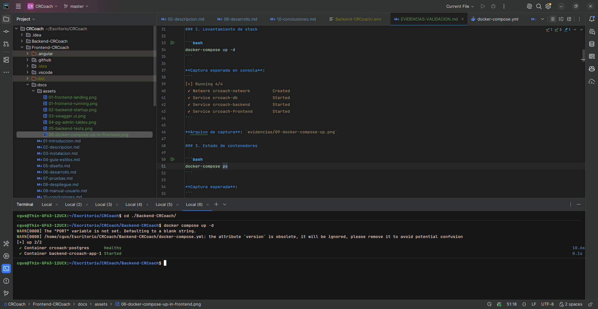
*Figura 8.1: Arranque del backend con Docker Compose*

```bash
# 4. Verificar que los servicios están funcionando
docker compose ps
```

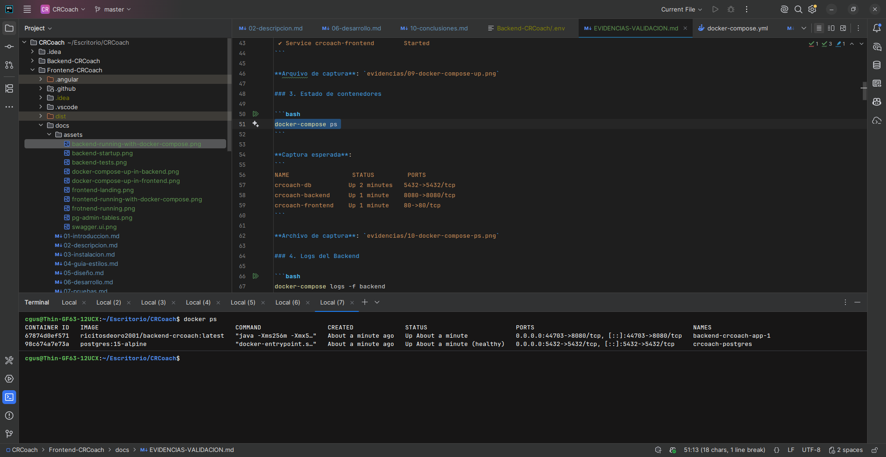
*Figura 8.2: Estado de los contenedores del backend*

```bash
# 5. Verificar logs del backend
docker compose logs app
```

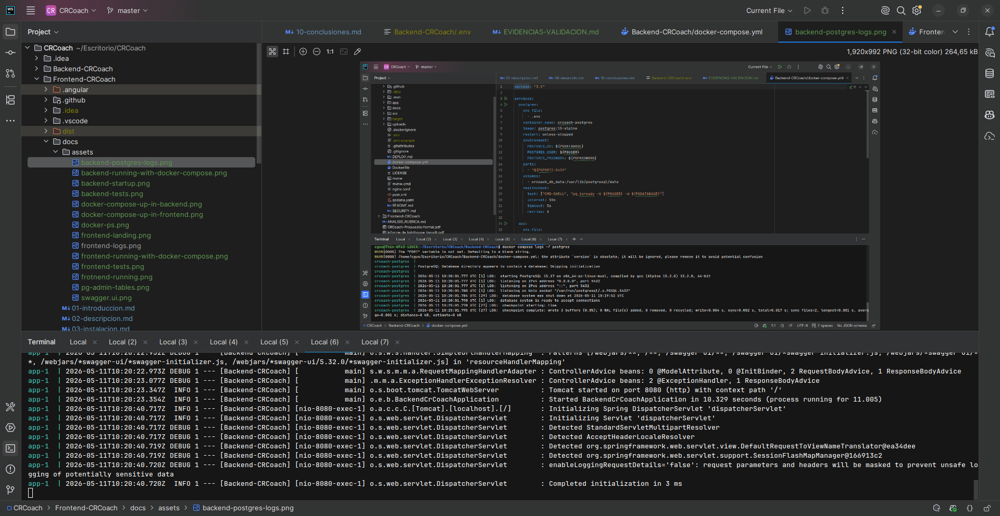
*Figura 8.3: Logs de arranque del backend*

```bash
# 6. Verificar que PostgreSQL está listo
docker compose logs postgres
```

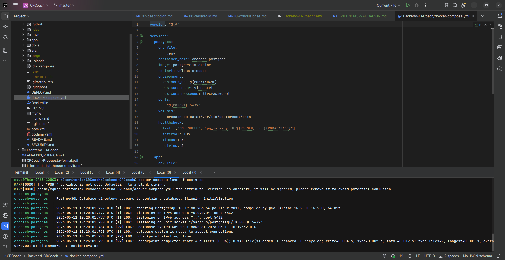
*Figura 8.4: Logs de PostgreSQL*

```bash
# 7. Health check
curl -I http://localhost:8080/
```

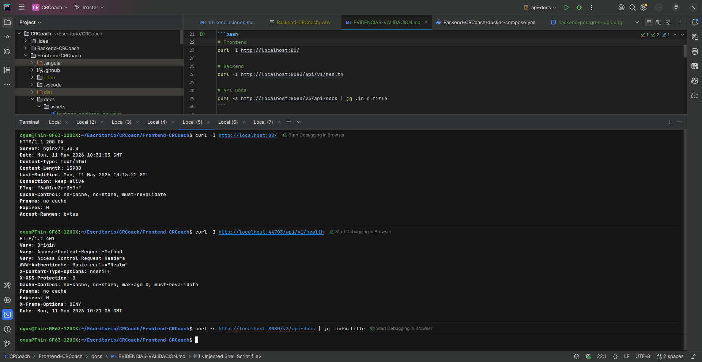
*Figura 8.5: Health check del backend*

```bash
# 8. Arrancar el frontend
cd ../Frontend-CRCoach
docker compose up -d Frontend-CRCoach
```

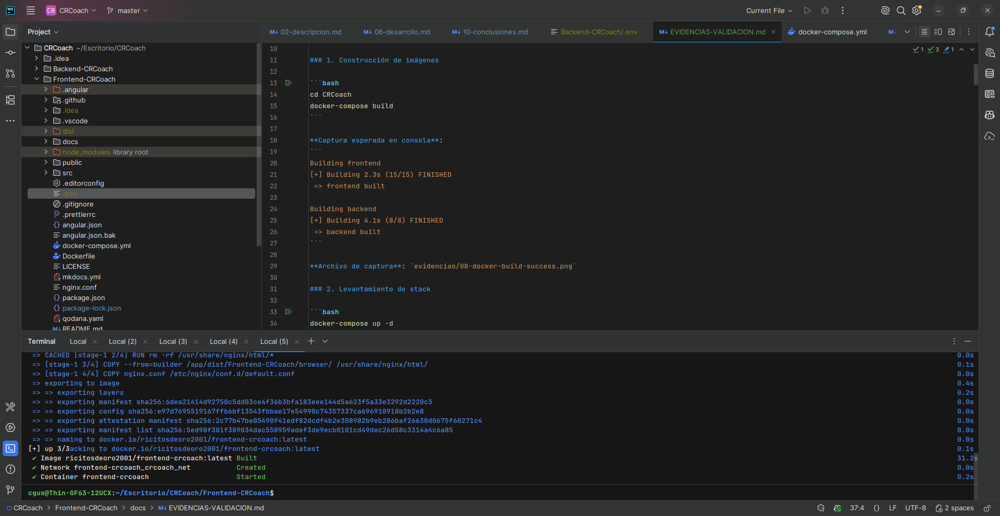
*Figura 8.6: Arranque del frontend con Docker Compose*

```bash
# 9. Verificar frontend
curl -I http://localhost/index.html
```

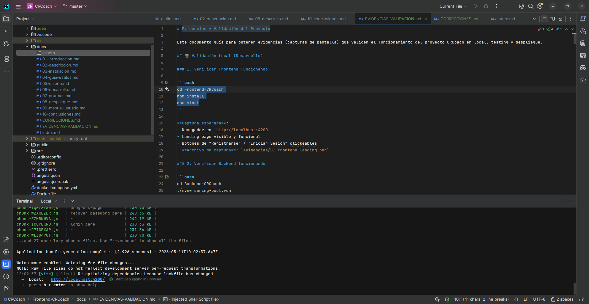
*Figura 8.7: Verificación del frontend funcionando*

```bash
# 10. Ver logs del frontend
docker compose logs -f Frontend-CRCoach
```

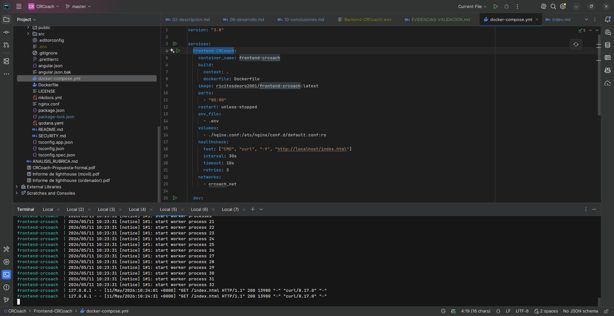
*Figura 8.8: Logs de Nginx sirviendo el frontend*

### 8.3.5. Configuración de Nginx (servidor web)

**Frontend (`nginx.conf`):**

```nginx
server {
    listen 80;
    server_name _;
    root /usr/share/nginx/html;
    index index.html;

    # Compresión gzip
    gzip on;
    gzip_types text/plain text/css application/json application/javascript
               text/xml application/xml application/xml+rss text/javascript;
    gzip_min_length 1000;

    # HTML - NO cache
    location = /index.html {
        add_header Cache-Control "no-cache, no-store, must-revalidate";
        add_header Pragma "no-cache";
        add_header Expires "0";
    }

    # SPA fallback - todas las rutas al index.html
    location / {
        try_files $uri $uri/ /index.html;
    }

    # JS y CSS - caché de 1 año (fingerprint por hash)
    location ~* \.(js|css)$ {
        expires 1y;
        add_header Cache-Control "public, max-age=31536000, immutable";
    }

    # Imágenes - caché de 6 meses
    location ~* \.(png|jpg|jpeg|gif|svg|webp|ico)$ {
        expires 6M;
        add_header Cache-Control "public, max-age=15552000";
    }

    # Fuentes - caché de 1 año + CORS
    location ~* \.(woff|woff2|ttf|otf|eot)$ {
        expires 1y;
        add_header Cache-Control "public, max-age=31536000, immutable";
        add_header Access-Control-Allow-Origin "*";
        try_files $uri =404;
    }
}
```

**Backend (`nginx.conf`) - para cuando se usa Nginx como proxy inverso:**

```nginx
server {
    listen 80;
    server_name _;
    root /usr/share/nginx/html;
    index index.html;

    # Compresión gzip
    gzip on;
    gzip_types text/plain text/css application/json application/javascript
               text/xml application/xml application/xml+rss text/javascript;
    gzip_min_length 1000;

    # Proxy para API
    location /api/ {
        proxy_pass http://app:8080/;
        proxy_set_header Host $host;
        proxy_set_header X-Real-IP $remote_addr;
        proxy_set_header X-Forwarded-For $proxy_add_x_forwarded_for;
        proxy_set_header X-Forwarded-Proto $scheme;
        add_header Cache-Control "no-store";
        proxy_connect_timeout 5s;
        proxy_read_timeout 60s;
    }
}
```

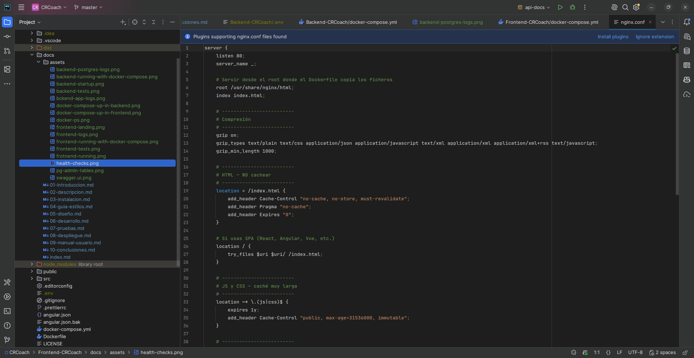
*Figura 8.9: Configuración de Nginx del frontend*

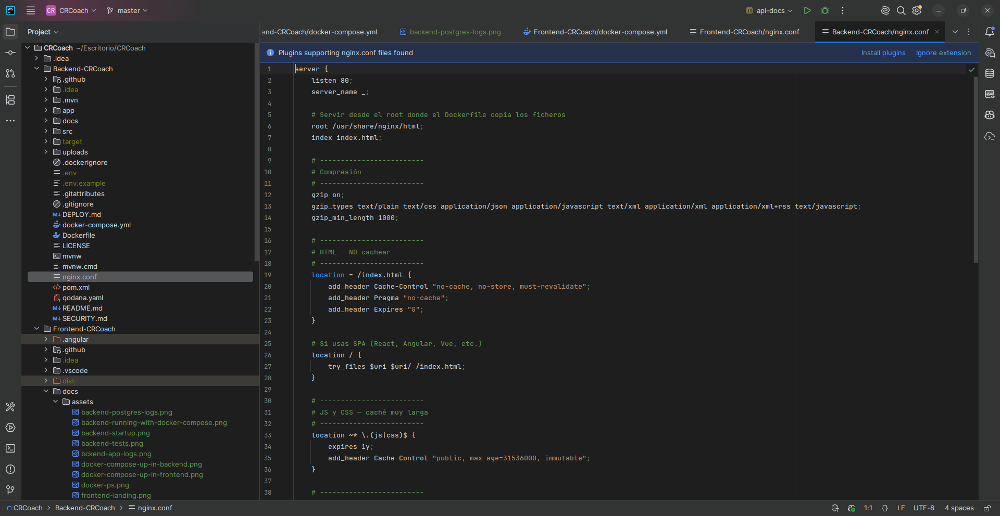
*Figura 8.10: Configuración de Nginx del backend*

### 8.3.6. Configuración de la base de datos en Neon

```sql
-- La base de datos se crea automáticamente con el plan gratuito de Neon
-- Las tablas se crean automáticamente con ddl-auto=update de Hibernate

-- Verificar tablas creadas:
SELECT table_name FROM information_schema.tables
WHERE table_schema = 'public'
ORDER BY table_name;
```

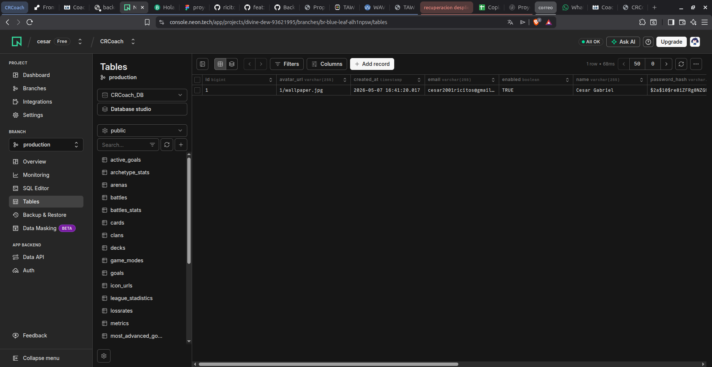
*Figura 8.11: Tablas creadas en PostgreSQL*

## 8.4. Verificación del despliegue

### 8.4.1. Verificación de red

```bash
# 1. Verificar resolución DNS
nslookup backend-crcoach.onrender.com
nslookup frontend-crcoach.onrender.com

# 2. Verificar conectividad
ping backend-crcoach.onrender.com
ping frontend-crcoach.onrender.com

# 3. Verificar puertos abiertos
nc -zv backend-crcoach.onrender.com 443
nc -zv frontend-crcoach.onrender.com 443
```

### 8.4.2. Verificación de la API

```bash
# 1. Health check básico
curl -s -o /dev/null -w "%{http_code}" https://backend-crcoach.onrender.com/
# Esperado: 200

# 2. Verificar Swagger
curl -s https://backend-crcoach.onrender.com/v3/api-docs | jq '.info.title'
# Esperado: "Backend-CRCoach"

# 3. Probar registro de usuario
curl -s -X POST https://backend-crcoach.onrender.com/api/v1/auth/register \
  -H "Content-Type: application/json" \
  -d '{
    "email": "demo@crcoach.com",
    "username": "demo",
    "password": "Demo1234!"
  }' | jq '.'
# Esperado: { "token": "eyJ...", "user": {...} }

# 4. Probar login
curl -s -X POST https://backend-crcoach.onrender.com/api/v1/auth/authenticate \
  -H "Content-Type: application/json" \
  -d '{
    "email": "demo@crcoach.com",
    "password": "Demo1234!"
  }' | jq '.token'
# Esperado: Token JWT

# 5. Obtener catálogo de cartas (público)
curl -s https://backend-crcoach.onrender.com/api/v1/cards | jq '. | length'
# Esperado: Número de cartas (aprox. 110+)
```

### 8.4.3. Verificación del frontend

```bash
# 1. Verificar que la SPA carga
curl -s https://frontend-crcoach.onrender.com/ | grep "<title>"
# Esperado: "<title>Coach Royale</title>"

# 2. Verificar cabeceras de caché
curl -I https://frontend-crcoach.onrender.com/index.html
# Esperado: Cache-Control: no-cache, no-store, must-revalidate

curl -I https://frontend-crcoach.onrender.com/main.js 2>/dev/null || \
curl -I https://frontend-crcoach.onrender.com/polyfills.js 2>/dev/null
# Esperado: Cache-Control: public, max-age=31536000, immutable

# 3. Verificar compresión gzip
curl -H "Accept-Encoding: gzip" \
  -o /dev/null -w "%{size_download}" \
  https://frontend-crcoach.onrender.com/
# Esperado: Tamaño comprimido (menor que sin comprimir)
```

### 8.4.4. Verificación de la comunicación frontend-backend

```bash
# 1. Desde el frontend, verificar que puede llamar al backend
# Abrir en navegador: https://frontend-crcoach.onrender.com/
# Abrir DevTools (F12) → Network
# Verificar que las peticiones a https://backend-crcoach.onrender.com/api/v1/ son exitosas

# 2. Verificar CORS
curl -s -X OPTIONS https://backend-crcoach.onrender.com/api/v1/cards \
  -H "Origin: https://frontend-crcoach.onrender.com" \
  -H "Access-Control-Request-Method: GET" \
  -I
# Esperado: Access-Control-Allow-Origin: https://frontend-crcoach.onrender.com
```

### 8.4.5. Prueba de rendimiento básica

```bash
# Prueba de carga con 50 peticiones concurrentes
for i in {1..50}; do
  curl -s -o /dev/null -w "Petición $i: %{http_code} - %{time_total}s\n" \
    https://backend-crcoach.onrender.com/api/v1/cards &
done
wait

# Medir tiempo de respuesta promedio
time for i in {1..10}; do
  curl -s -o /dev/null https://backend-crcoach.onrender.com/api/v1/cards
done
```

### 8.4.6. Verificación del polling automático

```bash
# 1. Verificar que el scheduler está activo
# Revisar los logs del backend en Render Dashboard
# Buscar líneas como:
# "Iniciando sincronización para perfil 1"
# "Sincronización completada: 3 nuevas batallas"

# 2. Verificar que se crean snapshots
curl -s https://backend-crcoach.onrender.com/api/v1/snapshots/by-user/1 \
  -H "Authorization: Bearer $TOKEN" | jq '. | length'
# Esperado: Número de snapshots > 0 si ha pasado tiempo suficiente
```

### 8.4.7. Verificación de la documentación Swagger

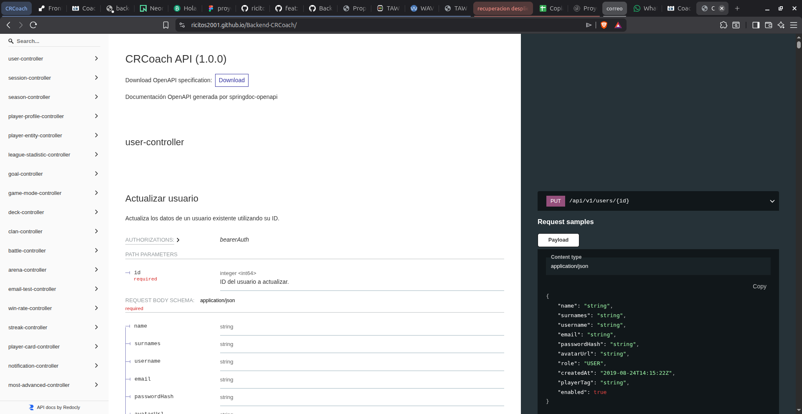
*Figura 8.12: Documentación Swagger de la API*

La documentación Swagger está disponible en:
```
https://backend-crcoach.onrender.com/swagger-ui/index.html
```

## 8.5. Variables de entorno

### Backend

| Variable | Descripción | Obligatoria | Ejemplo |
|:---------|:------------|:------------|:--------|
| `PGHOST` | Host de PostgreSQL | Sí | `ep-proyecto-pooler.c-3.eu-central-1.aws.neon.tech` |
| `PGPORT` | Puerto de PostgreSQL | Sí | `5432` |
| `PGDATABASE` | Nombre de la base de datos | Sí | `CRCoach_DB` |
| `PGUSER` | Usuario de la base de datos | Sí | `neondb_owner` |
| `PGPASSWORD` | Contraseña de la base de datos | Sí | `npg_abc123...` |
| `PORT` | Puerto del servidor | No (default: 8080) | `8080` |
| `CLASH_ROYALE_API_KEY` | API Key de Supercell | Sí | `eyJ0eXAi...` |
| `CLASH_ROYALE_API_URL` | URL base de la API | No | `https://api.clashroyale.com/v1` |
| `SPRING_HOST` | Servidor SMTP | Sí | `smtp-relay.brevo.com` |
| `SPRING_MAIL_USERNAME` | Usuario SMTP | Sí | `usuario@smtp-brevo.com` |
| `SPRING_MAIL_PASSWORD` | Contraseña SMTP | Sí | `xsmtpsib-...` |
| `BREVO_API_KEY` | API Key de Brevo | Sí | `xkeysib-...` |
| `BREVO_SENDER_EMAIL` | Email remitente | Sí | `crcoach@dominio.com` |
| `BREVO_SENDER_NAME` | Nombre del remitente | No (default: CRCoach) | `CRCoach` |
| `APP_FRONTEND_BASE_URL` | URL del frontend (CORS) | Sí | `https://frontend-crcoach.onrender.com` |

### Frontend

| Variable | Descripción | Obligatoria | Ejemplo |
|:---------|:------------|:------------|:--------|
| `apiUrl` | URL base del backend | Sí | `https://backend-crcoach.onrender.com` |

## 8.6. Dockerización

### Backend: Dockerfile multi-etapa

**Archivo real:** `Backend-CRCoach/Dockerfile`

```dockerfile
FROM maven:3.9.6-eclipse-temurin-21 AS builder
WORKDIR /usr/src/app

ARG NODE_ENV
ARG PORT

ENV PGHOST=""
ENV PGPORT=""
ENV PGDATABASE=""
ENV PGUSER=""
ENV PGPASSWORD=""
ENV SPRING_MAIL_USERNAME=""
ENV SPRING_MAIL_PASSWORD=""
ENV APP_FRONTEND_BASE_URL=""

ENV PORT=8080

COPY pom.xml .
COPY src ./src
RUN mvn -B -DskipTests package

FROM eclipse-temurin:21-jre-alpine
WORKDIR /app
COPY --from=builder /usr/src/app/target/Backend-CRCoach-0.0.1-SNAPSHOT.jar app.jar

ENV PORT=8080
EXPOSE 8080
ENTRYPOINT ["java","-Xms256m","-Xmx512m","-XX:+UseG1GC","-jar","/app/app.jar"]
```

### Frontend: Dockerfile multi-etapa

**Archivo real:** `Frontend-CRCoach/Dockerfile`

```dockerfile
# Etapa de compilación
FROM node:24-alpine AS builder

WORKDIR /app

# Copiamos solo package.json y package-lock.json primero para usar cache de Docker
COPY package.json package-lock.json ./

# Instalamos dependencias
RUN npm ci --legacy-peer-deps --silent

# Copiamos el resto de la aplicación
COPY . .

# Construimos la aplicación usando el script build:prod (ejecuta inyección de preloads)
RUN npm run build

# Etapa de producción - nginx
FROM nginx:stable-alpine

# Eliminamos contenido por defecto
RUN rm -rf /usr/share/nginx/html/*

# Copiamos los archivos compilados desde el builder
# Angular genera los ficheros estáticos en dist/<projectName>/browser; copiamos su contenido al root de nginx
COPY --from=builder /app/dist/Frontend-CRCoach/browser/ /usr/share/nginx/html/

# Copiamos la configuración de nginx para fallback en SPA
COPY nginx.conf /etc/nginx/conf.d/default.conf

# Puerto expuesto
EXPOSE 80

# Ejecutar nginx en primer plano
CMD ["nginx", "-g", "daemon off;"]
```

### docker-compose del backend

**Archivo real:** `Backend-CRCoach/docker-compose.yml`

```yaml
version: "3.9"

services:
  postgres:
    env_file:
      - .env
    container_name: crcoach-postgres
    image: postgres:15-alpine
    restart: unless-stopped
    environment:
      POSTGRES_DB: ${PGDATABASE}
      POSTGRES_USER: ${PGUSER}
      POSTGRES_PASSWORD: ${PGPASSWORD}
    ports:
      - "${PGPORT}:5432"
    volumes:
      - crcoach_db_data:/var/lib/postgresql/data
    healthcheck:
      test: ["CMD-SHELL", "pg_isready -U ${PGUSER} -d ${PGDATABASE}"]
      interval: 10s
      timeout: 5s
      retries: 5

  app:
    env_file:
      - .env
    build:
      context: .
      dockerfile: Dockerfile
    image: ricitosdeoro2001/backend-crcoach:latest
    restart: unless-stopped
    ports:
      - "${PORT}:8080"
    environment:
      SPRING_DATASOURCE_URL: "jdbc:postgresql://${PGHOST}:${PGPORT}/${PGDATABASE}?sslmode=require"
      SPRING_DATASOURCE_USERNAME: ${PGUSER}
      SPRING_DATASOURCE_PASSWORD: ${PGPASSWORD}
      SPRING_JPA_HIBERNATE_DDL_AUTO: "update"
      SERVER_PORT: 8080
    depends_on:
      postgres:
        condition: service_healthy
    volumes:
      - ./uploads:/app/uploads

volumes:
  crcoach_db_data: {}
```

### docker-compose del frontend

**Archivo real:** `Frontend-CRCoach/docker-compose.yml`

```yaml
version: "3.8"

services:
  Frontend-CRCoach:
    container_name: frontend-crcoach
    build:
      context: .
      dockerfile: Dockerfile
    image: ricitosdeoro2001/frontend-crcoach:latest
    ports:
      - "80:80"
    restart: unless-stopped
    env_file:
      - .env
    volumes:
      - ./nginx.conf:/etc/nginx/conf.d/default.conf:ro
    healthcheck:
      test: ["CMD", "curl", "-f", "http://localhost/index.html"]
      interval: 30s
      timeout: 10s
      retries: 3
    networks:
      - crcoach_net

  dev:
    image: node:24-alpine
    profiles: ["dev"]
    working_dir: /app
    command: sh -c "npm ci && npm run start -- --host 0.0.0.0"
    ports:
      - "4200:4200"
    environment:
      - CHOKIDAR_USEPOLLING=true
    volumes:
      - ./:/app:cached
      - crcoach_node_modules:/app/node_modules
    networks:
      - crcoach_net

volumes:
  crcoach_node_modules:
    driver: local

networks:
  crcoach_net:
    driver: bridge
```

## 8.7. URL de la aplicación en producción

| Recurso | URL |
|:--------|:----|
| **Frontend (aplicación)** | [https://frontend-crcoach.onrender.com](https://frontend-crcoach.onrender.com) |
| **Backend (API)** | [https://backend-crcoach.onrender.com](https://backend-crcoach.onrender.com) |
| **Swagger UI** | [https://backend-crcoach.onrender.com/swagger-ui/index.html](https://backend-crcoach.onrender.com/swagger-ui/index.html) |
| **Documentación** | GitHub Pages (rama gh-pages) |

## 8.8. Solución de problemas comunes

### Problema: El backend no arranca en Render

```
Causa posible: Variables de entorno incorrectas o incompletas.
Solución:
  1. Verificar que todas las variables están configuradas en Render Dashboard.
  2. Revisar los logs de build para identificar errores de compilación.
  3. Asegurar que la API Key de Supercell tiene la IP de Render en whitelist.
```

### Problema: Error 429 de la API de Supercell

```
Causa posible: Demasiadas peticiones a la API en poco tiempo.
Solución:
  1. Verificar los logs: "Rate limited" aparece en los logs del backend.
  2. El sistema reintenta automáticamente con backoff exponencial.
  3. Si persiste, aumentar el intervalo de polling en application.properties.
```

### Problema: CORS bloqueando peticiones

```
Causa posible: La URL del frontend no está en los orígenes permitidos.
Solución:
  1. Verificar que APP_FRONTEND_BASE_URL tiene el valor correcto.
  2. En SecurityConfig.java, asegurar que la URL está en allowedOrigins.
```

### Problema: La SPA del frontend muestra página en blanco

```
Causa posible: Error en las rutas de Angular o en el fallback de Nginx.
Solución:
  1. Verificar que nginx.conf tiene try_files $uri $uri/ /index.html;
  2. Revisar la consola del navegador para errores de JavaScript.
  3. Verificar que environment.apiUrl apunta al backend correcto.
```

### Problema: Error de conexión a la base de datos

```
Causa posible: Credenciales incorrectas o IP no permitida.
Solución:
  1. Verificar las variables PGHOST, PGPORT, PGDATABASE, PGUSER, PGPASSWORD.
  2. En Neon, verificar que la IP de Render está permitida en la configuración de red.
  3. Asegurar que la URL JDBC tiene sslmode=require.
```

### Problema: Los tests fallan en CI

```
Causa posible: Dependencias desactualizadas o configuración incorrecta.
Solución:
  1. Ejecutar tests localmente: ./mvnw test o npm test.
  2. Verificar que las versiones de las dependencias son compatibles.
  3. Revisar los logs de GitHub Actions para identificar el error específico.
```

## 8.9. Referencia de comandos

Esta sección explica en detalle cada comando utilizado en este documento, desglosando sus partes y parámetros.

### 8.9.1. Comandos de Docker

#### `docker compose up -d`

```bash
docker compose up -d
```

| Parte | Significado |
|:------|:------------|
| `docker` | Binario principal de Docker |
| `compose` | Subcomando para orquestación multi-contenedor |
| `up` | Crea y arranca los contenedores definidos en `docker-compose.yml` |
| `-d` | Modo *detached*: ejecuta los contenedores en segundo plano, liberando la terminal |

**Qué hace**: Lee el archivo `docker-compose.yml`, construye las imágenes si es necesario, crea las redes y volúmenes definidos, y arranca todos los servicios en segundo plano.

**Uso con servicios específicos:**
```bash
docker compose up -d Frontend-CRCoach    # Arranca solo un servicio concreto
docker compose up -d --profile dev       # Arranca servicios de un perfil concreto
```

#### `docker compose ps`

```bash
docker compose ps
```

| Parte | Significado |
|:------|:------------|
| `ps` | *Process Status*: muestra el estado de los contenedores |

**Qué hace**: Lista todos los contenedores gestionados por el archivo `docker-compose.yml`, mostrando:
- `NAME`: Nombre del contenedor.
- `IMAGE`: Imagen Docker que está usando.
- `COMMAND`: Comando que se ejecuta al arrancar.
- `SERVICE`: Servicio al que pertenece en el compose.
- `STATUS`: Estado actual (Up, Exited, Paused, Healthy).
- `PORTS`: Mapeo de puertos (host:contenedor).

**Salida de ejemplo:**
```
NAME                IMAGE                                    COMMAND                  SERVICE    STATUS          PORTS
frontend-crcoach    ricitosdeoro2001/frontend-crcoach:latest  "/docker-entrypoint.…"   app        Up 2 min        0.0.0.0:80->80/tcp
```

#### `docker compose logs`

```bash
docker compose logs app
docker compose logs -f app
```

| Parte | Significado |
|:------|:------------|
| `logs` | Muestra la salida de logs del contenedor |
| `-f` | Modo *follow*: mantiene la conexión abierta mostrando logs en tiempo real (equivalente a `tail -f`) |
| `app` | Nombre del servicio del que ver los logs |

**Qué hace**: Recupera y muestra la salida stdout/stderr del contenedor. Es la herramienta principal para depurar problemas en contenedores.

**Variantes útiles:**
```bash
docker compose logs --tail=100 app      # Últimas 100 líneas
docker compose logs --since=5m app      # Logs de los últimos 5 minutos
docker compose logs -t app              # Añade timestamp a cada línea
```

#### `docker compose down`

```bash
docker compose down
docker compose down -v
```

| Parte | Significado |
|:------|:------------|
| `down` | Detiene y elimina contenedores, redes y, opcionalmente, volúmenes |
| `-v` | Elimina también los volúmenes (incluyendo datos persistentes) |

**Qué hace**: Detiene los contenedores en ejecución, los elimina, y limpia las redes creadas por `up`. Sin `-v` los volúmenes persisten. Con `-v` se borran también los datos (útil para empezar desde cero).

#### `docker compose exec`

```bash
docker compose exec postgres pg_isready -U crcoach_user -d crcoach_db
```

| Parte | Significado |
|:------|:------------|
| `exec` | Ejecuta un comando dentro de un contenedor en ejecución |
| `postgres` | Nombre del servicio (contenedor objetivo) |
| `pg_isready` | Comando a ejecutar dentro del contenedor |
| `-U crcoach_user` | Usuario de PostgreSQL |
| `-d crcoach_db` | Base de datos a comprobar |

**Qué hace**: Ejecuta un comando arbitrario dentro de un contenedor que ya está en ejecución. Útil para depuración, inspección y administración.

**Otros ejemplos:**
```bash
docker compose exec postgres psql -U crcoach_user -d crcoach_db  # Abre consola SQL
docker compose exec app sh                                        # Abre shell dentro del contenedor
```

### 8.9.2. Comandos de curl

#### `curl [URL]` — Petición GET básica

```bash
curl https://backend-crcoach.onrender.com/
```

| Parte | Significado |
|:------|:------------|
| `curl` | *Client URL*: herramienta para transferir datos con sintaxis URL |
| `https://...` | URL destino de la petición |

**Qué hace**: Realiza una petición HTTP GET a la URL especificada y muestra el cuerpo de la respuesta por stdout. Es la herramienta estándar para probar APIs desde terminal.

#### `curl -I [URL]` — Solo cabeceras

```bash
curl -I https://frontend-crcoach.onrender.com/
```

| Parte | Significado |
|:------|:------------|
| `-I` | *Headers only*: realiza una petición HEAD, mostrando solo las cabeceras de respuesta |

**Qué hace**: Útil para verificar cabeceras HTTP sin descargar el cuerpo de la respuesta. Permite comprobar `Cache-Control`, `Content-Type`, `Status`, `CORS`, etc.

**Salida de ejemplo:**
```
HTTP/2 200
content-type: text/html
cache-control: no-cache, no-store, must-revalidate
```

#### `curl -X POST [URL]` — Petición POST

```bash
curl -X POST https://backend-crcoach.onrender.com/api/v1/auth/authenticate \
  -H "Content-Type: application/json" \
  -d '{"email":"test@test.com","password":"Test1234!"}'
```

| Parte | Significado |
|:------|:------------|
| `-X POST` | Especifica el método HTTP (GET, POST, PUT, DELETE, OPTIONS...) |
| `-H "Content-Type: application/json"` | Añade una cabecera HTTP personalizada (indica que enviamos JSON) |
| `-d '{"email":...}'` | *data*: cuerpo de la petición (los datos que se envían al servidor) |
| `\` | Barra invertida: permite continuar el comando en la siguiente línea (mejora legibilidad) |

**Qué hace**: Envía una petición POST con cuerpo JSON al servidor. Es la forma estándar de probar endpoints que crean recursos o autentican usuarios.

#### `curl -s` — Modo silencioso

```bash
curl -s -o /dev/null -w "%{http_code}" https://backend-crcoach.onrender.com/
```

| Parte | Significado |
|:------|:------------|
| `-s` | *Silent*: suprime la barra de progreso y mensajes de error |
| `-o /dev/null` | *Output*: descarta el cuerpo de la respuesta (no lo muestra) |
| `-w "%{http_code}"` | *Write out*: imprime solo el código de estado HTTP (200, 404, 500...) |

**Qué hace**: Realiza una petición y muestra **solo el código HTTP** (sin el body). Ideal para health checks y pruebas automatizadas donde solo interesa saber si el servidor responde correctamente.

#### `curl -L` — Seguir redirecciones

```bash
curl -L https://frontend-crcoach.onrender.com/
```

| Parte | Significado |
|:------|:------------|
| `-L` | *Location*: sigue automáticamente las redirecciones HTTP (302, 301) |

**Qué hace**: Si el servidor responde con una redirección (código 3xx), curl sigue automáticamente la nueva ubicación hasta llegar al destino final.

#### `curl -H "Accept-Encoding: gzip"` — Comprobar compresión

```bash
curl -H "Accept-Encoding: gzip" -o /dev/null -w "%{size_download}" https://frontend-crcoach.onrender.com/
```

| Parte | Significado |
|:------|:------------|
| `-H "Accept-Encoding: gzip"` | Indica al servidor que aceptamos contenido comprimido con gzip |
| `%{size_download}` | Variable que muestra el tamaño en bytes del contenido descargado |

**Qué hace**: Comprueba si el servidor aplica compresión gzip. Si el tamaño descargado es menor que el tamaño real del contenido, la compresión está activa.

#### `curl -X OPTIONS` — Verificar CORS

```bash
curl -s -X OPTIONS https://backend-crcoach.onrender.com/api/v1/cards \
  -H "Origin: https://frontend-crcoach.onrender.com" \
  -H "Access-Control-Request-Method: GET" \
  -I
```

| Parte | Significado |
|:------|:------------|
| `-X OPTIONS` | Método HTTP utilizado en peticiones pre-flight de CORS |
| `-H "Origin: ..."` | Simula que la petición viene desde ese origen |
| `-H "Access-Control-Request-Method: GET"` | Indica qué método HTTP se quiere usar tras el pre-flight |

**Qué hace**: Envía una petición pre-flight CORS para verificar si el servidor permite peticiones desde un origen específico. La respuesta debe incluir `Access-Control-Allow-Origin`.

### 8.9.3. Comandos de red

#### `nslookup [dominio]`

```bash
nslookup backend-crcoach.onrender.com
```

| Parte | Significado |
|:------|:------------|
| `nslookup` | *Name Server Lookup*: consulta el DNS para resolver un nombre de dominio a IP |

**Qué hace**: Muestra la dirección IP asociada a un nombre de dominio y el servidor DNS que resolvió la consulta. Útil para verificar que el DNS está configurado correctamente.

**Salida de ejemplo:**
```
Server:   8.8.8.8
Address:  8.8.8.8#53

Non-authoritative answer:
Name: backend-crcoach.onrender.com
Address: 216.24.57.1
```

#### `ping [dominio]`

```bash
ping backend-crcoach.onrender.com
```

| Parte | Significado |
|:------|:------------|
| `ping` | Envía paquetes ICMP Echo Request para verificar conectividad de red |

**Qué hace**: Comprueba si un host es reachable en la red midiendo el tiempo de ida y vuelta de los paquetes (RTT). Un ping exitoso confirma conectividad básica.

**Salida de ejemplo:**
```
PING backend-crcoach.onrender.com (216.24.57.1): 56 data bytes
64 bytes from 216.24.57.1: icmp_seq=0 ttl=53 time=12.345 ms
```

#### `nc -zv [host] [puerto]`

```bash
nc -zv backend-crcoach.onrender.com 443
```

| Parte | Significado |
|:------|:------------|
| `nc` | *Netcat*: herramienta de red versátil para leer/escribir datos en conexiones de red |
| `-z` | *Zero I/O*: modo escaneo, no envía datos solo comprueba si el puerto está abierto |
| `-v` | *Verbose*: muestra información detallada de la conexión |

**Qué hace**: Comprueba si un puerto específico está abierto en un host remoto. Más fiable que ping porque verifica la disponibilidad del servicio en el puerto concreto, no solo la conectividad ICMP.

### 8.9.4. Comandos de Git

#### `git clone [URL]`

```bash
git clone https://github.com/ricitos2001/Backend-CRCoach.git
```

| Parte | Significado |
|:------|:------------|
| `git` | Sistema de control de versiones distribuido |
| `clone` | Crea una copia local completa de un repositorio remoto |
| `https://...` | URL del repositorio a clonar |

**Qué hace**: Descarga el repositorio completo (incluyendo todo el historial de commits y ramas) y crea un directorio local con el código fuente.

### 8.9.5. Comandos de copia y enlaces

#### `cp [origen] [destino]`

```bash
cp .env.example .env
```

| Parte | Significado |
|:------|:------------|
| `cp` | *Copy*: copia archivos y directorios |

**Qué hace**: Crea una copia del archivo `.env.example` con nombre `.env`. Es el paso estándar para crear el archivo de variables de entorno a partir de la plantilla.

#### `chmod +x [archivo]`

```bash
chmod +x render
```

| Parte | Significado |
|:------|:------------|
| `chmod` | *Change Mode*: cambia los permisos de un archivo |
| `+x` | Añade permiso de ejecución (*execute*) |

**Qué hace**: Convierte un archivo en ejecutable. Sin este paso, no se podría ejecutar el binario de Render CLI descargado.

### 8.9.6. Redirecciones y tuberías

| Símbolo | Nombre | Significado |
|:--------|:-------|:------------|
| `> archivo` | Redirección de salida | Escribe la salida de un comando en un archivo (sobrescribe) |
| `>> archivo` | Redirección de append | Añade la salida al final de un archivo |
| `\|` | Pipe (tubería) | Conecta la salida de un comando con la entrada del siguiente |
| `2>/dev/null` | Redirección de error | Descarta los mensajes de error (los envía al "agujero negro") |
| `&` | Background | Ejecuta un comando en segundo plano |
| `&&` | AND lógico | Ejecuta el segundo comando solo si el primero tuvo éxito |
| `\` | Continuación | Permite escribir un comando en varias líneas |
| `$()` | Sustitución | Ejecuta el comando interno y usa su salida como argumento |
| `$(...)` | Sustitución moderna | Igual que `$()` pero anidable |

### 8.9.7. Comandos de Maven

#### `mvn -B verify`

```bash
mvn -B verify
```

| Parte | Significado |
|:------|:------------|
| `mvn` | *Maven*: herramienta de construcción y gestión de proyectos Java |
| `-B` | *Batch mode*: modo no interactivo (sin barras de progreso), ideal para CI |
| `verify` | Fase de Maven: compila, ejecuta tests y verifica que el proyecto es válido |

**Qué hace**: Ejecuta el ciclo de vida completo de Maven hasta la fase `verify`, que incluye: compilación, ejecución de tests unitarios y de integración, y validación del empaquetado. Es el comando estándar para CI.

### 8.9.8. Comandos de npm

#### `npm install / npm ci`

```bash
npm install
npm ci --legacy-peer-deps --silent
```

| Parte | Significado |
|:------|:------------|
| `npm` | *Node Package Manager*: gestor de paquetes de Node.js |
| `install` | Instala dependencias leyendo `package.json` y `package-lock.json` |
| `ci` | *Clean Install*: instalación limpia usando solo `package-lock.json` (más rápido y reproducible) |
| `--legacy-peer-deps` | Usa algoritmo antiguo de resolución de dependencias (evita conflictos) |
| `--silent` | Suprime la salida innecesaria |

**Qué hace**: Descarga e instala todas las dependencias del proyecto Node.js. `npm ci` se usa en producción/Docker porque es más rápido y determinista que `npm install`.

#### `npm run build`

```bash
npm run build
```

| Parte | Significado |
|:------|:------------|
| `npm run build` | Ejecuta el script `build` definido en `package.json` |

**Qué hace**: En Angular, compila la aplicación para producción generando los archivos estáticos en `dist/`. Incluye optimizaciones como minificación, tree-shaking y hashing de archivos.

### 8.9.9. Comandos de sistema

#### `for` loop (Shell)

```bash
for i in {1..50}; do
  curl -s -o /dev/null -w "Petición $i: %{http_code} - %{time_total}s\n" \
    https://backend-crcoach.onrender.com/api/v1/cards &
done
wait
```

| Parte | Significado |
|:------|:------------|
| `for i in {1..50}` | Bucle que itera 50 veces (i=1, i=2, ..., i=50) |
| `; do ... ; done` | Cuerpo del bucle |
| `$i` | Variable que contiene el número de iteración actual |
| `&` | Ejecuta cada curl en segundo plano (paralelo) |
| `wait` | Espera a que todos los procesos en background terminen |

**Qué hace**: Lanza 50 peticiones curl concurrentes para simular una prueba de carga básica. Mide el código de estado y tiempo de cada petición.

#### `time [comando]`

```bash
time for i in {1..10}; do
  curl -s -o /dev/null https://backend-crcoach.onrender.com/api/v1/cards
done
```

| Parte | Significado |
|:------|:------------|
| `time` | Mide el tiempo real de ejecución de un comando |

**Qué hace**: Ejecuta el comando y muestra tres métricas de tiempo:
- `real`: tiempo total transcurrido (wall clock).
- `user`: tiempo de CPU en modo usuario.
- `sys`: tiempo de CPU en modo kernel.

## 8.10. Uso avanzado de Docker build

### 8.10.1. Sintaxis completa de `docker build`

```bash
docker build [opciones] -t nombre:tag [ruta_del_contexto]
```

| Parámetro | Significado |
|:----------|:------------|
| `-t nombre:tag` | *Tag*: nombre y versión de la imagen (ej: `frontend-crcoach:latest`) |
| `-f archivo` | *File*: especifica un Dockerfile con nombre diferente (ej: `Dockerfile.prod`) |
| `--build-arg CLAVE=valor` | Pasa variables de construcción al Dockerfile |
| `--no-cache` | Fuerza reconstrucción sin usar caché de capas |
| `--platform linux/amd64` | Especifica la plataforma destino (útil para multi-arquitectura) |
| `--target etapa` | Construye solo hasta una etapa concreta del multi-stage |
| `--progress plain` | Muestra el progreso en texto plano (útil para CI) |
| `--secret id=...` | Pasa secretos de forma segura sin que queden en la imagen |
| `--ssh default` | Permite usar agentes SSH durante el build |
| `--output type=local,dest=./out` | Exporta archivos del build al host |
| `.` | Contexto de build (directorio actual que se envía al daemon de Docker) |

### 8.10.2. Ejemplos prácticos

#### Build básico con tag

```bash
docker build -t frontend-crcoach:latest .
```

**Explicación**: Construye la imagen usando el `Dockerfile` del directorio actual, le asigna el nombre `frontend-crcoach` con tag `latest`. Es el comando más básico y común.

#### Build con Dockerfile específico

```bash
docker build -f Dockerfile.prod -t backend-crcoach:production .
```

**Explicación**: Usa un archivo `Dockerfile.prod` en lugar del `Dockerfile` por defecto. Útil cuando tienes múltiples configuraciones de build (desarrollo, producción, testing).

#### Build sin caché

```bash
docker build --no-cache -t frontend-crcoach:latest .
```

**Explicación**: Fuerza la reconstrucción completa de todas las capas ignorando la caché de Docker. Útil cuando se sospecha que la caché está usando código obsoleto o cuando se quiere garantizar una build limpia (por ejemplo, después de actualizar dependencias de seguridad).

#### Build con argumentos de build

```bash
docker build \
  --build-arg NODE_ENV=production \
  --build-arg API_URL=https://backend-crcoach.onrender.com \
  -t frontend-crcoach:latest .
```

**Explicación**: Pasa variables de entorno al Dockerfile mediante `ARG`. Dentro del Dockerfile se usan con `ARG NODE_ENV` y `$NODE_ENV`. Útil para parametrizar la construcción sin modificar el Dockerfile.

#### Build hasta una etapa específica (multi-stage)

```bash
docker build --target builder -t frontend-crcoach:builder .
```

**Explicación**: En un Dockerfile multi-stage, `--target` detiene la construcción en la etapa indicada. En el ejemplo, construye solo la etapa `builder` (donde está Node.js) sin llegar a la etapa final de Nginx. Esto es útil para:
- **Depuración**: Obtener una imagen con herramientas de desarrollo para inspeccionar el build.
- **CI/CD**: Ejecutar tests dentro del contenedor de build antes de generar la imagen final.
- **Desarrollo**: Iterar rápidamente sin esperar a la etapa de producción.

#### Build para plataforma específica

```bash
docker build --platform linux/amd64 -t backend-crcoach:latest .
```

**Explicación**: Construye la imagen para una plataforma concreta (por ejemplo, `linux/amd64` en lugar de `linux/arm64`). Esencial cuando:
- Desarrollas en un Mac con Apple Silicon (ARM) pero despliegas en servidores x86_64 (AMD).
- Usas servicios cloud que solo soportan arquitecturas específicas.
- Necesitas compatibilidad cruzada.

#### Build con progreso detallado

```bash
docker build --progress plain -t frontend-crcoach:latest . 2>&1
```

**Explicación**: Muestra la salida completa del build sin barras de progreso interactivas. Cada paso del Dockerfile se muestra con su salida detallada. Ideal para logs de CI/CD (GitHub Actions, Jenkins, GitLab CI) donde no hay terminal interactiva.

#### Build multi-arquitectura (buildx)

```bash
# Crear un builder multi-arquitectura (solo una vez)
docker buildx create --name multiarch --driver docker-container --use

# Build para múltiples plataformas simultáneamente
docker buildx build \
  --platform linux/amd64,linux/arm64 \
  -t ricitosdeoro2001/frontend-crcoach:latest \
  --push .
```

| Parte | Significado |
|:------|:------------|
| `buildx` | Extensión de Docker para builds avanzados (multi-plataforma) |
| `--platform linux/amd64,linux/arm64` | Construye para ambas arquitecturas simultáneamente |
| `--push` | Sube las imágenes directamente al registry (Docker Hub) |

**Explicación**: `docker buildx` es una extensión que permite builds multi-arquitectura. Construye imágenes para `amd64` (servidores x86) y `arm64` (Apple Silicon, Raspberry Pi, servidores ARM como AWS Graviton) en un solo comando. Docker Hub muestra automáticamente la imagen correcta según la arquitectura del cliente.

### 8.10.3. Optimización de builds de Docker

#### Estrategia de capas y caché

Docker construye las imágenes por capas (*layers*). Cada instrucción en el Dockerfile crea una capa que se cachea. Para maximizar la reutilización de la caché:

```dockerfile
# ❌ MAL: la caché se invalida al cambiar cualquier archivo del proyecto
COPY . .
RUN npm install

# ✅ BIEN: primero copiar solo package.json, instalar, luego copiar el resto
COPY package.json package-lock.json ./
RUN npm ci --legacy-peer-deps --silent    # Esta capa solo se reconstruye si cambian las dependencias
COPY . .                                   # Esta capa se reconstruye al cambiar código fuente
```

**Explicación**: Separando la copia de `package.json` de la del resto del código, Docker puede cachear la instalación de dependencias (`npm ci`) y solo re-ejecutarla cuando cambie `package.json`. Esto reduce drásticamente el tiempo de build en iteraciones de desarrollo (de minutos a segundos).

#### Multi-stage building

```dockerfile
# Stage 1: Build (pesado, con herramientas de compilación)
FROM node:24-alpine AS builder
WORKDIR /app
COPY package.json package-lock.json ./
RUN npm ci --legacy-peer-deps --silent
COPY . .
RUN npm run build                  # Genera dist/ (archivos estáticos)

# Stage 2: Production (ligero, solo runtime)
FROM nginx:stable-alpine           # Imagen mucho más pequeña (solo 20MB vs 500MB de Node)
COPY --from=builder /app/dist/Frontend-CRCoach/browser/ /usr/share/nginx/html/
COPY nginx.conf /etc/nginx/conf.d/default.conf
EXPOSE 80
CMD ["nginx", "-g", "daemon off;"]
```

**Explicación**: Multi-stage usa dos imágenes base diferentes:
1. **Stage builder**: Usa `node:24-alpine` (~300MB) con todas las herramientas de compilación.
2. **Stage producción**: Usa `nginx:stable-alpine` (~20MB) solo con lo necesario para servir archivos estáticos.

La imagen final solo contiene lo que se copia desde la etapa builder (`dist/` y `nginx.conf`), sin incluir Node.js, npm, dependencias de desarrollo ni código fuente. **Resultado: imagen de 20MB en lugar de 500MB**.

#### Uso de `.dockerignore`

```dockerfile
# .dockerignore - excluir archivos innecesarios del contexto de build
node_modules
.git
.gitignore
*.md
.env
.env.example
dist/
.git/
.github/
.vscode/
.idea/
```

**Explicación**: El archivo `.dockerignore` funciona como `.gitignore` pero para Docker. Excluye archivos y directorios del contexto de build (lo que se envía al daemon de Docker). Beneficios:
- **Velocidad**: El contexto de build es más pequeño, se transfiere más rápido.
- **Seguridad**: No se envían secretos (`.env`) ni archivos sensibles al daemon.
- **Caché**: Menos cambios en el contexto = más capas cacheadas.
- **Tamaño**: La imagen final no contiene archivos innecesarios (como `node_modules` que se regenera).

#### Build con secrets (seguridad)

```dockerfile
# Dockerfile
# Usar --secret para pasar tokens sin que queden en la imagen
RUN --mount=type=secret,id=npm_token \
    NPM_TOKEN=$(cat /run/secrets/npm_token) \
    npm install --registry=https://private-registry.com
```

```bash
# Build
docker build --secret id=npm_token,src=./npm_token.txt -t app:latest .
```

**Explicación**: El flag `--secret` permite pasar información sensible (tokens, claves API) durante el build sin que queden almacenadas en las capas de la imagen. El secreto está disponible en `/run/secrets/<id>` solo durante la ejecución de la instrucción `RUN` con `--mount=type=secret`. Tras completarse, el secreto no persiste en la imagen final. Esto es **fundamental para seguridad**: sin `--secret`, un token usado en `RUN` quedaría visible en el historial de capas de la imagen.

### 8.10.4. Publicación de imágenes en Docker Hub

```bash
# 1. Iniciar sesión en Docker Hub
docker login -u ricitosdeoro2001

# 2. Construir la imagen
docker build -t ricitosdeoro2001/frontend-crcoach:latest .

# 3. Publicar la imagen
docker push ricitosdeoro2001/frontend-crcoach:latest

# 4. Publicar con múltiples tags
docker tag ricitosdeoro2001/frontend-crcoach:latest ricitosdeoro2001/frontend-crcoach:1.0.0
docker push ricitosdeoro2001/frontend-crcoach:1.0.0
```

| Comando | Significado |
|:--------|:------------|
| `docker login` | Autentica el cliente Docker con Docker Hub |
| `docker push` | Sube la imagen local al registry remoto (Docker Hub) |
| `docker tag` | Crea un alias (tag) adicional para la misma imagen |

**Explicación**: Publicar imágenes en Docker Hub permite:
- **Compartir**: Otros desarrolladores pueden descargar la imagen con `docker pull`.
- **Despliegue**: Servicios como Render pueden descargar la imagen automáticamente.
- **Versionado**: Usar tags como `latest`, `1.0.0`, `v2.1.0` para identificar versiones.
- **CI/CD**: GitHub Actions puede construir y publicar imágenes automáticamente.

## 8.11. Mantenimiento y monitoreo

### Tareas periódicas

| Frecuencia | Tarea | Descripción |
|:-----------|:------|:------------|
| Diaria | Revisar logs | Verificar que el polling funciona correctamente |
| Semanal | Verificar uso de BD | Comprobar que no se supera el límite de Neon (512MB) |
| Semanal | Dependabot | Revisar y aplicar PRs de actualización de dependencias |
| Mensual | Renovar API keys | Verificar que las claves de Supercell y Brevo siguen activas |
| Trimestral | Revisar costes | Verificar que no se han generado costes inesperados |

### Alertas

- Render envía notificaciones por email si el servicio se cae.
- GitHub Actions notifica si un workflow falla.
- Dependabot crea PRs automáticos para vulnerabilidades de seguridad.
