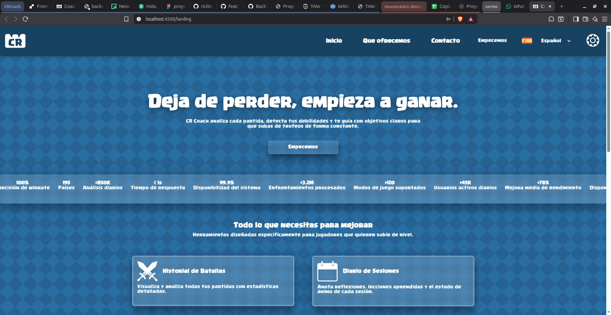

# 9. Manual de usuario

## 9.1. Introducción

**CRCoach** es una plataforma web diseñada para ayudarte a mejorar en Clash Royale. Analiza tu rendimiento, detecta tus debilidades, te permite establecer objetivos de mejora y hace seguimiento de tu evolución a lo largo del tiempo.

### Requisitos técnicos

- **Navegador**: Chrome 90+, Firefox 90+, Safari 15+, Edge 90+.
- **Conexión a internet**: Necesaria para sincronizar datos con la API de Clash Royale.
- **Cuenta de Clash Royale**: Necesitas un Player Tag válido (ej: `#8PL9YC2LJ`).

## 9.2. Primeros pasos

### 9.2.1. Registro

1. Abre la aplicación en [https://frontend-crcoach.onrender.com](https://frontend-crcoach.onrender.com).
2. Haz clic en **"Registrarse"** en la esquina superior derecha.


*Figura 9.1: Página de aterrizaje de CRCoach*

3. Completa el formulario:
   - **Email**: Dirección de correo electrónico válida.
   - **Nombre de usuario**: Cómo te llamarás en la plataforma.
   - **Contraseña**: Mínimo 8 caracteres, debe contener mayúsculas, minúsculas, números y al menos un carácter especial.

4. Haz clic en **"Crear cuenta"**.

5. Recibirás un email de bienvenida (si el servicio de email está configurado).

### 9.2.2. Inicio de sesión

1. Haz clic en **"Iniciar sesión"** en la página de aterrizaje.
2. Introduce tu email y contraseña.
3. Haz clic en **"Entrar"**.

### 9.2.3. Vincular tu cuenta de Clash Royale

Una vez dentro de la aplicación, el primer paso es vincular tu cuenta de Clash Royale:

1. Ve a tu **perfil** (icono 👤 en el sidebar).
2. En la sección **"Cuenta de Clash Royale"**:
   - Introduce tu **Player Tag** (incluyendo el `#`).
   - Ejemplo: `#8PL9YC2LJ`
3. Haz clic en **"Vincular"**.
4. El sistema verificará que el tag existe en la API oficial de Supercell.
5. ¡Listo! Tu perfil se ha vinculado correctamente.

> **¿Dónde encuentro mi Player Tag?**
> Abre Clash Royale → Perfil → Tu nombre aparece encima del avatar. El Player Tag está debajo de tu nombre (empieza por `#`).

## 9.3. Dashboard principal

Al iniciar sesión, verás el **Dashboard** con un resumen de tu rendimiento:


*Figura 9.2: Dashboard principal (representación)*

### Indicadores clave

| Indicador | Descripción |
|:----------|:------------|
| 🏆 **Trofeos** | Número actual de trofeos y variación semanal |
| 📊 **Winrate** | Porcentaje de victorias global |
| 🔥 **Racha** | Racha actual de victorias o derrotas consecutivas |
| 📈 **Tendencia** | Evolución en la última semana |

### Gráfica de evolución

La gráfica principal muestra la evolución de tus trofeos a lo largo del tiempo. Puedes:

- Pasar el ratón por encima para ver valores exactos.
- Seleccionar un rango de fechas para hacer zoom.
- Ver la tendencia general de tu progreso.

### Últimas batallas

En la parte inferior del dashboard se muestran tus últimas batallas con:

- Resultado (✅ victoria / ❌ derrota).
- Cambio de trofeos (+30, -28).
- Mazo utilizado y mazo rival.
- Fecha y hora.

## 9.4. Historial de batallas

### Cómo usar el historial

1. Haz clic en **"Batallas"** en el sidebar (icono ⚔️).
2. Verás un listado completo de todas tus batallas almacenadas.

### Filtrar batallas

Puedes filtrar las batallas usando los siguientes criterios:

| Filtro | Opciones |
|:-------|:---------|
| **Resultado** | Todas, Victoria, Derrota |
| **Modo de juego** | Ladder, Desafío, Torneo, Amistoso |
| **Fecha** | Hoy, Última semana, Último mes, Personalizado |
| **Arquetipo rival** | Beatdown, Control, Cycle, Siege, etc. |

### Ver detalle de una batalla

Haz clic en cualquier batalla para ver:

- Mazo completo usado por ti y por el rival.
- Cartas de cada jugador con niveles.
- Duración de la batalla.
- Cambio de trofeos.
- Modo de juego y arena.

## 9.5. Diagnóstico de debilidades

### Cómo usar el diagnóstico

1. Haz clic en **"Debilidades"** en el sidebar (icono 🐞).
2. El sistema analizará automáticamente tus batallas y generará un reporte.

### Winrate por arquetipo

La gráfica de barras muestra tu porcentaje de victorias contra cada arquetipo:

```
Cycle:      ████████████░░ 60%  ← Bueno
Control:    ██████████░░░░ 50%  ← Normal
Siege:      ████████░░░░░░ 40%  ← Mejorable
Beatdown:   ██████░░░░░░░░ 30%  ← Crítico
```

**Interpretación**: Si tienes un winrate bajo contra un arquetipo, significa que necesitas practicar más contra ese estilo de juego.

### Cartas problemáticas

Identifica las cartas específicas contra las que pierdes más:

| Carta | Winrate | Veces enfrentada |
|:------|:--------|:-----------------|
| Mega Knight | 28% | 25 batallas |
| Hog Rider | 35% | 20 batallas |
| Fireball | 40% | 15 batallas |

### Recomendaciones

El sistema genera recomendaciones personalizadas basadas en tus debilidades detectadas. Por ejemplo:

- "Practica contra Beatdown en desafíos gratuitos."
- "Añade más construcciones a tu mazo para counterar a Mega Knight."
- "Ve vídeos de jugadores top con tu mazo para aprender nuevas estrategias."

## 9.6. Sistema de objetivos

### Crear un objetivo

1. Haz clic en **"Objetivos"** en el sidebar (icono 🎯).
2. Haz clic en **"Nuevo objetivo"**.
3. Completa el formulario:

| Campo | Descripción | Ejemplo |
|:------|:------------|:--------|
| **Título** | Nombre del objetivo | "Llegar a 6000 trofeos" |
| **Descripción** | Detalles adicionales | "Subir desde 5230 hasta 6000" |
| **Tipo** | Categoría | Trofeos, Winrate, Partidas |
| **Valor objetivo** | Meta a alcanzar | 6000 |
| **Valor actual** | Valor inicial | 5230 |
| **Fecha límite** | Fecha tope | 30/04/2026 |

4. Haz clic en **"Crear objetivo"**.

### Seguimiento de objetivos

Los objetivos se actualizan automáticamente con cada sincronización:

```
🎯 Llegar a 6000 trofeos
   Progreso: ████████████░░░░░░ 77%
   Actual: 5230 → Meta: 6000
   Tiempo restante: 45 días
   Estado: En progreso ✅
```

### Estados de los objetivos

| Estado | Descripción |
|:-------|:------------|
| 🔵 **En progreso** | El objetivo está activo y en seguimiento |
| 🟢 **Completado** | Has alcanzado la meta establecida |
| 🔴 **Fallido** | No has alcanzado la meta antes de la fecha límite |
| ⚪ **Pendiente** | Objetivo creado pero aún no activo |

## 9.7. Diario de sesiones

### Crear una sesión

1. Haz clic en **"Sesiones"** en el sidebar (icono 📝).
2. Haz clic en **"Nueva sesión"**.
3. Completa el formulario:

| Campo | Descripción |
|:------|:------------|
| **Título** | Nombre de la sesión (ej: "Sesión de ladder") |
| **Notas** | Reflexiones sobre cómo jugaste, qué aprendiste |
| **Estado de ánimo** | 😊 Feliz, 😐 Neutral, 😞 Frustrado |
| **Fecha y hora** | Cuándo jugaste |

4. Haz clic en **"Guardar"**.

**Ejemplo de entrada en el diario:**
```
📝 Sesión de ladder - 15/03/2026
   😊 Estado: Feliz
   Notas: Hoy probé el mazo de Hog Cycle que vi en un vídeo.
   Funcionó muy bien contra Beatdown, pero sigo perdiendo
   contra Mega Knight. Necesito practicar más ese matchup.
```

## 9.8. Gráfica de evolución

### Cómo usar la gráfica

1. Haz clic en **"Progreso"** en el sidebar (icono 📈).
2. Verás una gráfica interactiva con la evolución de tus trofeos.

### Funcionalidades

- **Zoom**: Selecciona un rango de fechas para ampliar.
- **Tooltips**: Pasa el ratón por encima para ver valores exactos.
- **Leyenda**: Muestra qué línea corresponde a qué métrica.
- **Periodos**: Puedes seleccionar 1 semana, 1 mes, 3 meses o todo el histórico.

### Interpretación

- **Tendencia al alza**: Estás mejorando.
- **Meseta**: Estás estancado, quizás necesitas cambiar tu enfoque.
- **Caídas**: Identifica qué cambió en esas fechas (cambio de mazo, nueva liga).

## 9.9. Panel de usuario

### Acceso al perfil

Haz clic en el icono 👤 en el sidebar o en la esquina superior derecha.

### Secciones del perfil

| Sección | Descripción |
|:--------|:------------|
| **Información personal** | Editar nombre, email y preferencias |
| **Cambiar contraseña** | Actualizar tu contraseña |
| **Cuenta de Clash Royale** | Vincular/desvincular Player Tag |
| **Preferencias** | Idioma, tema oscuro/claro |
| **Eliminar cuenta** | Eliminar permanentemente tu cuenta y datos |

### Cambiar idioma

CRCoach está disponible en español e inglés:

1. Ve a tu **perfil**.
2. En la sección **"Idioma"**, selecciona Español o English.
3. La interfaz se actualizará automáticamente.

### Activar tema oscuro

1. Haz clic en el icono 🌙/☀️ en la esquina superior derecha.
2. Alterna entre tema claro y oscuro.
3. La preferencia se guarda automáticamente.

## 9.10. Recuperación de contraseña

Si has olvidado tu contraseña:

1. En la página de inicio de sesión, haz clic en **"¿Olvidaste tu contraseña?"**.
2. Introduce tu email.
3. Recibirás un correo con un enlace para restablecer la contraseña.
4. Haz clic en el enlace y establece una nueva contraseña.
5. Inicia sesión con tu nueva contraseña.

> **Nota**: El enlace de recuperación tiene una validez limitada (generalmente 1 hora).

## 9.11. Solución de problemas comunes

### "Mis batallas no se actualizan"

```
Causa: El polling automático ocurre cada 5 minutos.
Solución:
  1. Espera unos minutos y recarga la página.
  2. Usa el botón de "Actualizar" en el dashboard para forzar una sincronización manual.
  3. Verifica que tu Player Tag sigue siendo válido.
```

### "El diagnóstico muestra datos incorrectos"

```
Causa: El sistema necesita un mínimo de batallas para generar un diagnóstico fiable.
Solución:
  1. Asegúrate de tener al menos 20-30 batallas almacenadas.
  2. La clasificación de arquetipos es automática y puede tener errores en mazos poco comunes.
```

### "No puedo iniciar sesión"

```
Causa: Contraseña incorrecta o cuenta no verificada.
Solución:
  1. Usa la función "¿Olvidaste tu contraseña?" para restablecerla.
  2. Verifica que estás usando el email correcto.
  3. Si el problema persiste, contacta con el administrador.
```

### "Error al vincular mi Player Tag"

```
Causa: El tag no existe o la API de Supercell no responde.
Solución:
  1. Verifica que el tag está bien escrito (incluyendo #).
  2. Asegúrate de que el tag existe en el juego.
  3. La API de Supercell puede estar temporalmente caída. Inténtalo más tarde.
```

### "La aplicación va lenta"

```
Causa: Puede ser la conexión a internet o la carga inicial de datos.
Solución:
  1. La primera carga puede ser más lenta mientras se descargan los assets.
  2. Las sucesivas cargas serán más rápidas gracias a la caché del navegador.
  3. Verifica tu conexión a internet.
```

## 9.12. Preguntas frecuentes (FAQ)

### ¿Cuánto cuesta CRCoach?

CRCoach es completamente **gratuito** durante el desarrollo del TFG. No hay planes de monetización a corto plazo.

### ¿Qué datos almacenáis de mí?

Solo almacenamos los datos necesarios para el funcionamiento:
- Email y nombre de usuario (para la cuenta).
- Player Tag (para sincronizar con Clash Royale).
- Historial de batallas (para el análisis).
- Objetivos y sesiones que tú mismo creas.

Consulta nuestra [Política de privacidad](https://frontend-crcoach.onrender.com/privacy) para más información.

### ¿Puedo eliminar mis datos?

Sí. En cualquier momento puedes eliminar tu cuenta desde el panel de perfil. Esto eliminará permanentemente todos tus datos asociados (derecho al olvido).

### ¿Con qué frecuencia se actualizan mis datos?

El sistema sincroniza automáticamente tus datos cada **5 minutos**. También puedes forzar una sincronización manual en cualquier momento.

### ¿Funciona con cualquier cuenta de Clash Royale?

Sí, siempre que el Player Tag sea válido y la API de Supercell esté operativa. Funciona con cuentas de cualquier nivel y región.

### ¿Puedo usar CRCoach en el móvil?

Sí, la aplicación es completamente **responsive** y se adapta a cualquier tamaño de pantalla, incluyendo móviles y tablets.

### ¿Cómo se clasifican los arquetipos?

El sistema analiza las cartas del mazo rival y las clasifica en arquetipos basándose en:
- Cartas características del mazo (Golem = Beatdown, X-Bow = Siege, etc.).
- Coste de elixir medio del mazo.
- Combinaciones conocidas (LavaLoon, LumberLoon, etc.).

### ¿Puedo compartir mis estadísticas?

Actualmente no hay funcionalidad de perfil público, pero está planificada para futuras versiones.

## 9.13. Contacto y soporte

Si tienes problemas o sugerencias, puedes contactar a través de:

- **Email**: cesar2001ricitos@gmail.com
- **GitHub**: [https://github.com/ricitos2001](https://github.com/ricitos2001)
- **Reportar issues**: Abre un issue en el repositorio de GitHub.
